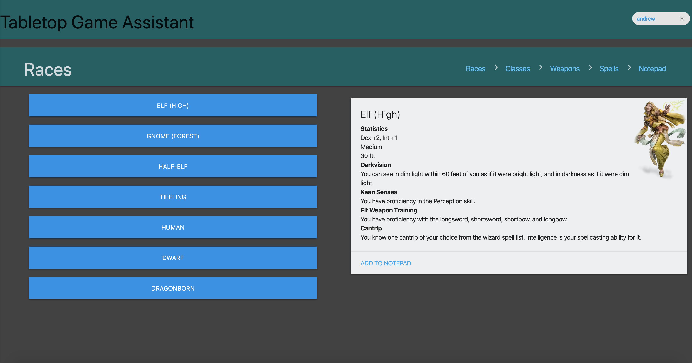
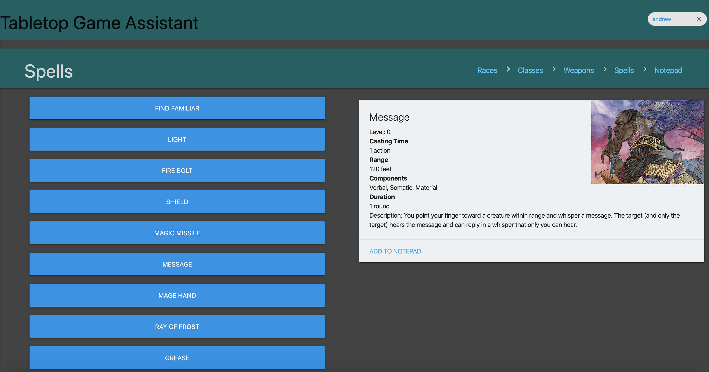
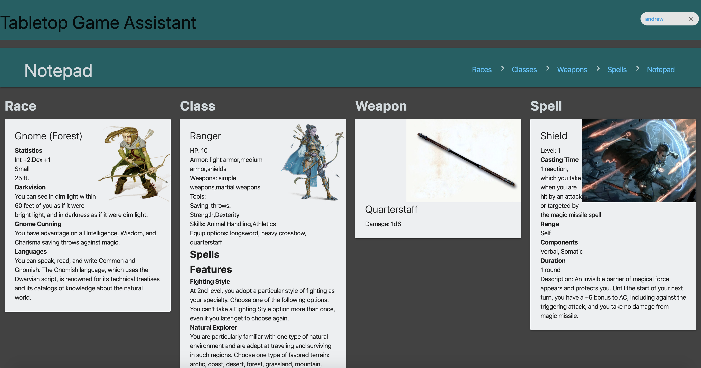
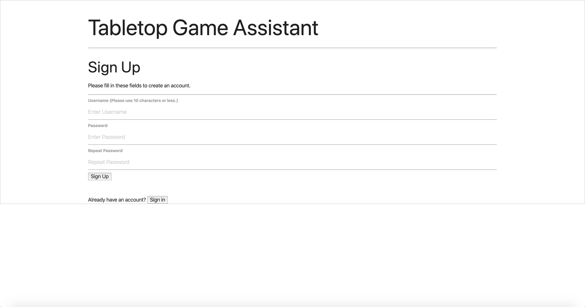
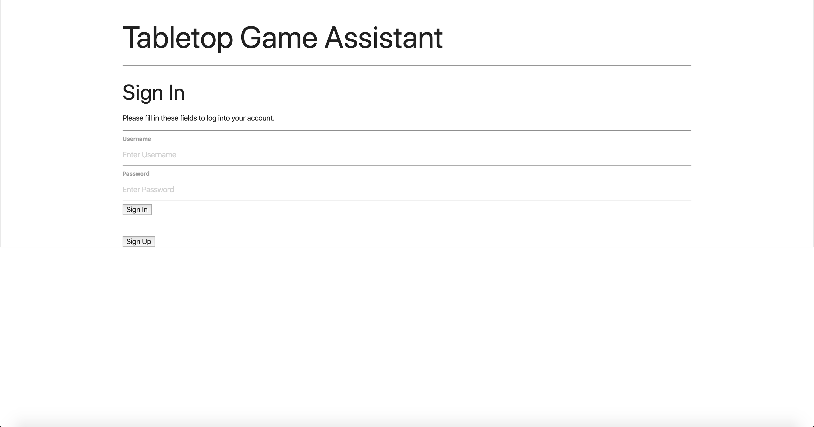

# Problem & Related Work
Many people want to get into tabletop games, but most of them are incredibly difficult to learn. One of the most well-known tabletop games, Dungeons & Dragons, has scared off potential players for years, due mainly to its large, multiple rulebooks and their confusing layout and design. Tabletop games in their current state are not welcoming to players of all skill levels and this is severely limiting the accessibility of the medium.

One current solution to making tabletop games easier to learn is 5e.tools. This website compiles important information from Dungeons & Dragons into clear and concise categories. Information is granted at the click of the button, and the user can only see the information that is most pertinent to their goals. We chose this concept as a starting point, making information both easy to find and readily accessible. One effort we chose to build upon was the storing of information the player would like to refer back to. Another effort we wanted to improve was visual presentation; 5e.tools is text-heavy with little to no pictures throughout.

# User Research
Through our interviews and observations, we wanted to learn about the experience current tabletop players have with existing rulebooks and manuals. We wanted to discover what users find helpful in current rulebooks, in addition to what they find cumbersome and frustrating. During our research, we made sure to assess a mixture of skill levels; some users were still new to tabletop games while others were seasoned veterans. We chose to conduct interviews, in which we first asked interviewees about their experience with rulebooks and what they have found effective and ineffective. Then, the interviewee was prompted to provide ideas and suggestions on what their ideal tabletop rulebook would be.

The main theme we discovered in our interviews was the retrieval of information. With current, physical rulebooks, it simply takes players too long to sift through and find one piece of information. Therefore, we decided our app should allow users to quickly navigate to a data point. Another common complaint we found was the saving of information. Users noted how it would be difficult to store away information for later in large rulebooks, due to their need to constantly be flipping through them and having to have various pieces of information handy at a time. As a result, we reasoned our app should have a store feature where users can place information to be viewed later. From testing, we found that our program would be useful to both novice and expert players of tabletop games: both expressed frustration with rulebooks, so both could certainly find value in a more accessible database.

# Paper Prototyping

Our concept was well received by testers. Several of our testers, who had been interviewed the week before, had mentioned that a digital assistant with which to store information would be very welcome in their DnD sessions, and our paper prototype seemed to be similar to what they were envisioning. When using the paper prototypes, some users did have issues with navigating the pages as well as choosing the weapons or spells available to them based on their class and race.

A problem we encountered with prototyping was encoding the sheer amount of information that would be required to create a prototype that included all of the numbers and interactions within DnD. After paper prototyping, we decided that restricting the amount of information available to the user was the best option.

# High-Fidelity Prototyping
The first task we chose to support was the ability to navigate pages for races, classes, weapons, and spells and be able to view their options. Below you can see two pages players can navigate to, along with an example of one of the options available at each page. Each option provides the player with statistics, abilities, and an appropriate image.

The second task we chose to support was the ability to save information. To achieve this, we included a notepad, to which users could clip specific information and access at a later point in one single page. Below you can see an example of a user's notepad, which has saved the race, class, weapon, and spell that they chose.

The last task we chose to support was the ability for users to create accounts in order to modify and view their own personal notepad. Below you can see a sign-up page for new members and a sign-in page for returning members.

The three components we chose to implement were interactive data selection, through the inclusion of buttons that displayed data when pressed, gamification through the inclusion of achievements that were displayed when certain tasks were accomplished and a page that listed the user’s achievements, and user profiles, using local storage on the computer to store the separate profiles.

# Reflection
In the end, we managed to create an application that is capable of displaying information found in Dungeons & Dragons Fifth Edition and copy it to a single notepad page for the user’s convenience. The app also allows for the creation of multiple user accounts on one computer.
If we were to continue this project, our team would focus on encoding more information into the application, including pages for other features of the full Dungeons & Dragons game such as feats, items, and a bestiary. We would also like to expand the program to provide support for other tabletop games such as Call of Cthulhu.

# Links
Repository: https://github.com/330-Team/Tabletop-Project

Working prototype: https://330-team.github.io/Tabletop-Project/signup.html

#### Instructions
Tabletop Game Assistant is compatible with any browser and OS, but for best results, please use Google Chrome on a Windows or Mac device.
